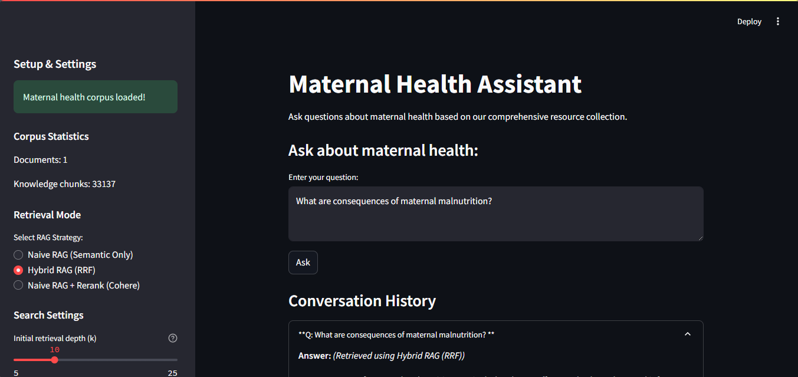
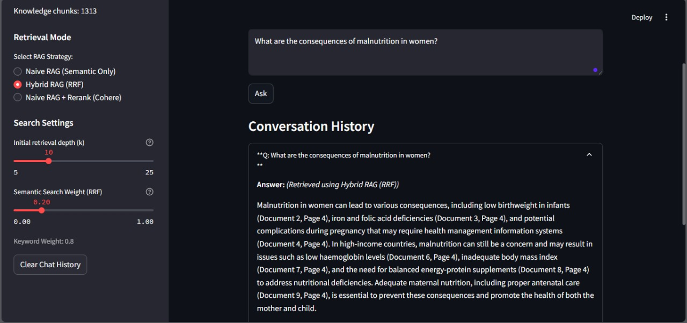
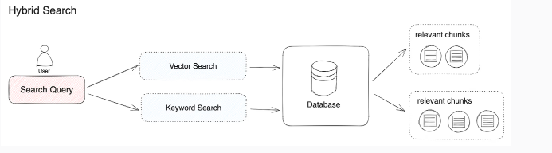

# Maternal Health Assistant

This project implements a Retrieval-Augmented Generation (RAG) system focused on answering questions about maternal health based on a provided corpus of documents. It uses Streamlit for the user interface and LangChain for the RAG pipeline components.

<!-- Screenshot of the main UI -->


## Features

*   **Document Loading:** Loads PDF documents from the `app/data` directory.
*   **Text Splitting:** Splits documents into manageable chunks for processing.
*   **Vector Embeddings:** Creates vector embeddings using Sentence Transformers (`all-mpnet-base-v2`) and stores them in a FAISS index.
*   **Multiple RAG Modes:**
    *   **Naive RAG:** Standard vector similarity search.
    *   **Hybrid RAG (RRF):** Combines semantic search (FAISS) with keyword search (BM25) using Reciprocal Rank Fusion (RRF). Allows adjusting the weight between semantic and keyword results.
    *   **Naive RAG + Rerank:** Uses a Cohere reranker to improve the relevance of initial semantic search results.

*   **LLM Integration:** Uses OpenAI's Chat models (`ChatOpenAI`) to generate answers based on retrieved context.
*   **Source Citation:** Generated answers include citations pointing to the source document and page number.
*   **Source Document Download:** Allows users to download the original source PDFs cited in the answer directly from the UI ([app/app.py](app/app.py)).
    <!-- Screenshot of Source Display -->
    
*   **Streamlit UI:** Interactive web interface for loading data, asking questions, selecting RAG modes, and viewing results ([app/app.py](app/app.py)).
*   **Evaluation:** Includes a script (`evaluation/evaluate.py`) to evaluate the RAG pipeline's performance against a predefined dataset ([evaluation/evaluation_dataset.json](evaluation/evaluation_dataset.json)) using metrics like ROUGE and BLEU.
*   **Debugging:** Generates debug files (`debug_*.json`, `debug_*.txt`) in the `app/` directory for inspecting retrieval, ranking, and generation steps.

## Pipeline Overview

The application follows a Hybrid RAG pipeline:

<!-- Diagram illustrating the RAG pipeline -->


1.  **Load:** PDF documents are loaded from the `app/data` directory.
2.  **Split:** Documents are split into smaller chunks.
3.  **Embed & Store:** Text chunks are embedded, and vectors are stored in a FAISS index ([app/embeddings](app/embeddings)).
4.  **Retrieve:** Based on the user query and selected RAG mode, relevant chunks are retrieved using FAISS (semantic), BM25 (keyword), or a combination (RRF).
5.  **Rerank (Optional):** If the Rerank mode is selected, retrieved chunks are reranked using Cohere.
6.  **Generate:** The top-ranked chunks are formatted as context and passed along with the query to an LLM (OpenAI) to generate a cited answer.

## Setup

1.  **Clone the repository:**
    ```bash
    git clone <your-repository-url>
    cd Gen-ai-project-2
    ```
2.  **Create a virtual environment (recommended):**
    ```bash
    python -m venv venv
    source venv/bin/activate  # On Windows use `venv\Scripts\activate`
    ```
3.  **Install dependencies:**
    ```bash
    pip install -r requirements.txt
    ```
4.  **Set up Environment Variables:**
    Create a `.env` file in the project root directory and add your API keys:
    ```env
    # .env
    OPENAI_API_KEY="your_openai_api_key"
    COHERE_API_KEY="your_cohere_api_key" # Required for Rerank mode
    ```
5.  **Add Data:**
    Place your PDF documents into the `app/data/` directory. The current example uses `https://www.unicef.org/pakistan/reports/pakistan-maternal-nutrition-strategy-2022-27`.


## Running the Application

1.  Ensure your virtual environment is activated.
2.  Run the Streamlit app:
    ```bash
    streamlit run app/app.py
    ```
3.  Open your web browser and navigate to the local URL provided by Streamlit (usually `http://localhost:8501`).
4.  Use the sidebar to load the corpus, select the RAG mode, and adjust settings.
5.  Enter your questions in the chat input.

## Running Evaluation

1.  Ensure your virtual environment is activated and the `.env` file is set up.
2.  Make sure you have an evaluation dataset in `evaluation/evaluation_dataset.json`.
3.  Run the evaluation script:
    ```bash
    python evaluation/evaluate.py
    ```
4.  Results will be saved to `evaluation/evaluation_results.json`.

## Directory Structure

*   `.env`: Stores API keys and environment variables.
*   `app/`: Contains the main Streamlit application (`app.py`), modules for different pipeline steps (`modules/`), data files (`data/`), and cached embeddings (`embeddings/`). Also stores runtime debug files.
*   `evaluation/`: Contains scripts (`evaluate.py`) and data (`evaluation_dataset.json`, `evaluation_results.json`) for evaluating the RAG pipeline.
*   `images/`: Contains images used in the README.
*   `requirements.txt`: Lists Python dependencies.
*   `README.md`: This file.